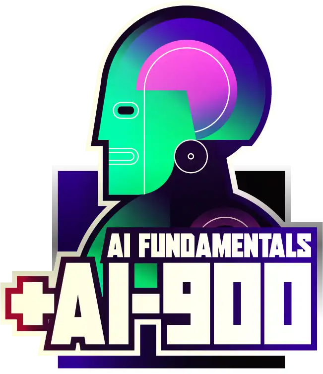

# **Bootcamp DIO Microsoft Azure AI Fundamentals**

Este projeto foi desenvolvido através do Bootcamp Microsoft Azure AI Fundamentals, oferecido pela plataforma [Digital Innovation One](https://www.dio.me/) em parceria com a [Microsoft](https://microsoft.com/). A iniciativa também se baseou na documentação [Exame AI-900: Microsoft Azure AI Fundamentals](https://learn.microsoft.com/pt-br/credentials/certifications/exams/ai-900/) da Microsoft.

O objetivo principal desse bootcamp é obter uma introdução aos serviços Azure.

## **Projetos**

### [LAB-01: Machine Learning](./projects/LAB-01/README.md)

### [LAB-02: Visão Computacional](./projects/LAB-02/README.md)

### **[LAB-03: Processamento de Linguagem Natural](./projects/LAB-03/README.md)**

### [LAB-04: Informação de Documentos e Mineração de Conhecimento](./projects/LAB-04/README.md)

### [LAB-05: IA Generativa](./projects/LAB-05/README.md)

## Certificado de conclusão

 :mortar_board: [Microsoft Azure AI Fundamentals](https://www.dio.me/certificate/DJWKRGD3) 
