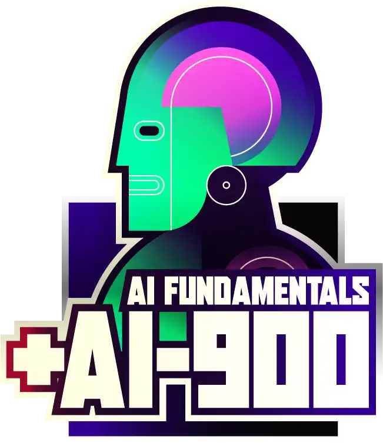

<pre style="font-size: 0.6rem;">

                              \\\\\\
                           \\\\\\\\\\\\
                          \\\\\\\\\\\\\\\
-------------,-|           |C>   // )\\\\|    .o88b. db   db  .d8b.  db    db  .d8b.  d888888b d888888b d88888b
           ,','|          /    || ,'/////|   d8P  Y8 88   88 d8' '8b 88    88 d8' '8b '~~88~~' '~~88~~' 88'    
---------,','  |         (,    ||   /////    8P      88ooo88 88ooo88 Y8    8P 88ooo88    88       88    88ooooo 
         ||    |          \\  ||||//''''|    8b      88~~~88 88~~~88 '8b  d8' 88~~~88    88       88    88~~~~~ 
         ||    |           |||||||     _|    Y8b  d8 88   88 88   88  '8bd8'  88   88    88       88    88.     
         ||    |______      ''''\____/ \      'Y88P' YP   YP YP   YP    YP    YP   YP    YP       YP    Y88888P
         ||    |     ,|         _/_____/ \
         ||  ,'    ,' |        /          |                 ___________________________________________
         ||,'    ,'   |       |         \  |              / \                                           \ 
_________|/    ,'     |      /           | |             |  |                                            | 
_____________,'      ,',_____|      |    | |              \ |      chavatte@duck.com                     | 
             |     ,','      |      |    | |                |                        chavatte.42web.io   | 
             |   ,','    ____|_____/    /  |                |    ________________________________________|___
             | ,','  __/ |             /   |                |  /                                            /
_____________|','   ///_/-------------/   |                 \_/____________________________________________/ 
              |===========,'                                                                                    
			  

</pre>

# **Bootcamp DIO Microsoft Azure AI Fundamentals**

Este projeto foi desenvolvido através do Bootcamp Microsoft Azure AI Fundamentals, oferecido pela plataforma [Digital Innovation One](https://www.dio.me/) em parceria com a [Microsoft](https://microsoft.com/). A iniciativa também se baseou na documentação [Exame AI-900: Microsoft Azure AI Fundamentals](https://learn.microsoft.com/pt-br/credentials/certifications/exams/ai-900/) da Microsoft.

O objetivo principal desse bootcamp é obter uma introdução aos serviços Azure.

## **Projetos**

### [LAB-01: Machine Learning](./projects/LAB-01/README.md)

### [LAB-02: Visão Computacional](./projects/LAB-02/README.md)

### **[LAB-03: Processamento de Linguagem Natural](./projects/LAB-03/README.md)**

### [LAB-04: Informação de Documentos e Mineração de Conhecimento](./projects/LAB-04/README.md)

### [LAB-05: IA Generativa](./projects/LAB-05/README.md)

## Certificado de conclusão

 :mortar_board: [Microsoft Azure AI Fundamentals](https://www.dio.me/certificate/DJWKRGD3) 
