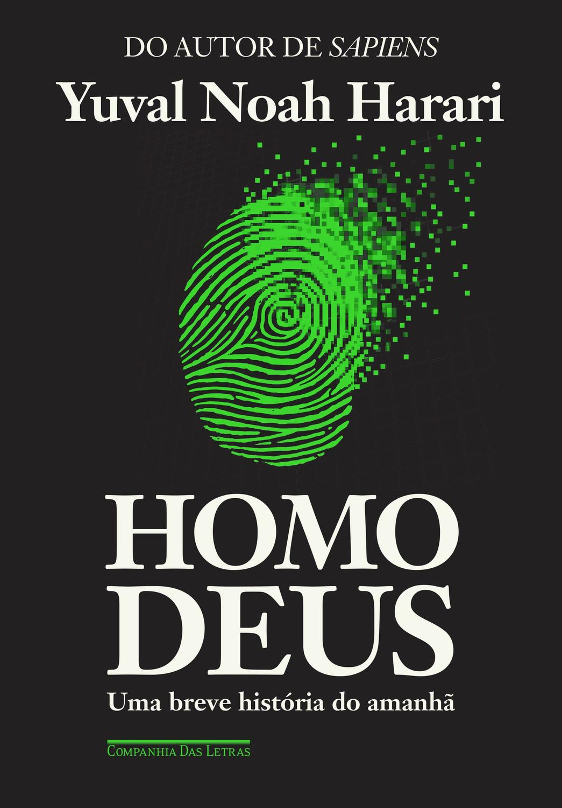
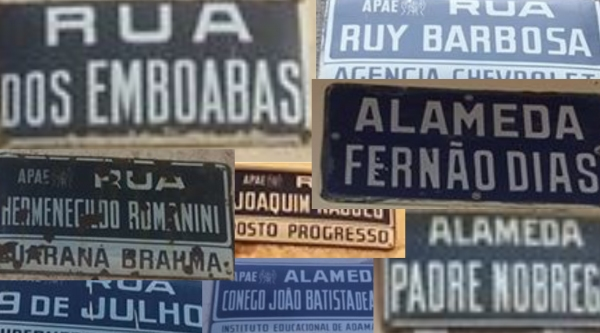
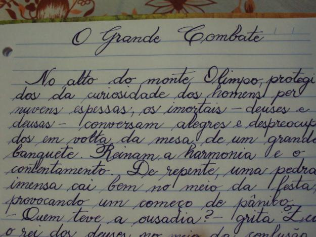

# Visão Computacional com Azure Machine Learning e Azure Vision Studio

<details>
<summary>Descrição detalhada do processo</summary>

Esse texto descreve como foi utilizado nesse bootcamp e como utilizar o Azure Machine Learning e o Azure Vision Studio para realizar tarefas de visão computacional. A visão computacional é um ramo da inteligência artificial que permite que computadores interpretem e compreendam o conteúdo de imagens e vídeos.

**Etapas necessárias:**

1. **Criar uma conta no Azure:** Acesse o portal do Azure através do link [https://portal.azure.com](https://portal.azure.com/) e siga as instruções para criar uma conta gratuita ou paga.
2. **Obter uma assinatura válida:** O Azure oferece um período de teste gratuito de 1 mês com $200 em créditos para testar seus serviços. Após o período de teste, é necessário adquirir uma assinatura paga para continuar utilizando os serviços.
3. **Criar um recurso "Azure AI services":** Dentro do portal do Azure, acesse a seção "Criar um recurso" e procure por "Azure AI services". Siga as instruções para criar um novo recurso.
4. **Acessar o Vision Studio:** Acesse o Vision Studio através do link [https://portal.vision.cognitive.azure.com/](https://portal.vision.cognitive.azure.com/) para começar a utilizar as ferramentas de visão computacional.

**Recursos utilizados nesse LAB:**

* **Reconhecimento de faces:** [https://microsoftlearning.github.io/mslearn-ai-fundamentals/Instructions/Labs/04-face.html](https://microsoftlearning.github.io/mslearn-ai-fundamentals/Instructions/Labs/04-face.html)
* **Reconhecimento de texto(OCR):** [https://microsoftlearning.github.io/mslearn-ai-fundamentals/Instructions/Labs/05-ocr.html](https://microsoftlearning.github.io/mslearn-ai-fundamentals/Instructions/Labs/05-ocr.html)
* **Analise de Imagens:** [https://microsoftlearning.github.io/mslearn-ai-fundamentals/Instructions/Labs/03-image-analysis.html](https://microsoftlearning.github.io/mslearn-ai-fundamentals/Instructions/Labs/03-image-analysis.html)

</details>

<details>
<summary>Reconhecimento de Faces</summary>

#### Imagem-01:


##### Atributos Detectados:
Face #1
Face mask: no

Face #2
Face mask: no

Face #3
Face mask: no

Face #4
Face mask: no

**Json File** - [/output/face_img_1.json](./output/face_img_1.json)
```json

[
  {
    "recognitionModel": "face_img_1",
    "faceRectangle": {
      "width": 71,
      "height": 104,
      "left": 306,
      "top": 74
    },
    "faceLandmarks": {
      "pupilLeft": {
        "x": 328.5,
        "y": 114.4
      },
      "pupilRight": {
        "x": 360.2,
        "y": 109.8
      },
      "noseTip": {
        "x": 350.4,
        "y": 130.6
      },
      "mouthLeft": {
        "x": 330.7,
        "y": 146.2
      },
      "mouthRight": {
        "x": 365.7,
        "y": 140.8
      },
      "eyebrowLeftOuter": {
        "x": 316.3,
        "y": 110.5
      },
      "eyebrowLeftInner": {
        "x": 336.3,
        "y": 106.5
      },
      "eyeLeftOuter": {
        "x": 322.8,
        "y": 115.4
      },
      "eyeLeftTop": {
        "x": 328.9,
        "y": 113
      },
      "eyeLeftBottom": {
        "x": 328.3,
        "y": 115.3
      },
      "eyeLeftInner": {
        "x": 334.1,
        "y": 113.8
      },
      "eyebrowRightInner": {
        "x": 352.4,
        "y": 104.5
      },
      "eyebrowRightOuter": {
        "x": 369.8,
        "y": 103.2
      },
      "eyeRightInner": {
        "x": 355,
        "y": 110.9
      },
      "eyeRightTop": {
        "x": 359.8,
        "y": 108.4
      },
      "eyeRightBottom": {
        "x": 360.6,
        "y": 110.7
      },
      "eyeRightOuter": {
        "x": 365.4,
        "y": 109.1
      },
      "noseRootLeft": {
        "x": 340.9,
        "y": 114.7
      },
      "noseRootRight": {
        "x": 350.4,
        "y": 113.4
      },
      "noseLeftAlarTop": {
        "x": 340.1,
        "y": 125.9
      },
      "noseRightAlarTop": {
        "x": 355.5,
        "y": 123.5
      },
      "noseLeftAlarOutTip": {
        "x": 337.1,
        "y": 132
      },
      "noseRightAlarOutTip": {
        "x": 359.3,
        "y": 128.9
      },
      "upperLipTop": {
        "x": 351,
        "y": 141.6
      },
      "upperLipBottom": {
        "x": 350.6,
        "y": 144.1
      },
      "underLipTop": {
        "x": 351.5,
        "y": 152.9
      },
      "underLipBottom": {
        "x": 352,
        "y": 157.3
      }
    },
    "faceAttributes": {
      "mask": {
        "type": "noMask",
        "noseAndMouthCovered": false
      }
    }
  },
  {
    "recognitionModel": "recognition_01",
    "faceRectangle": {
      "width": 69,
      "height": 98,
      "left": 615,
      "top": 69
    },
    "faceLandmarks": {
      "pupilLeft": {
        "x": 623.7,
        "y": 113.3
      },
      "pupilRight": {
        "x": 648.5,
        "y": 105.8
      },
      "noseTip": {
        "x": 628.7,
        "y": 123.7
      },
      "mouthLeft": {
        "x": 630.6,
        "y": 142.7
      },
      "mouthRight": {
        "x": 656.3,
        "y": 135.8
      },
      "eyebrowLeftOuter": {
        "x": 616.1,
        "y": 106.9
      },
      "eyebrowLeftInner": {
        "x": 625.1,
        "y": 103.3
      },
      "eyeLeftOuter": {
        "x": 620.5,
        "y": 114.7
      },
      "eyeLeftTop": {
        "x": 623.3,
        "y": 112.2
      },
      "eyeLeftBottom": {
        "x": 623.5,
        "y": 114.3
      },
      "eyeLeftInner": {
        "x": 627.6,
        "y": 112.2
      },
      "eyebrowRightInner": {
        "x": 637.5,
        "y": 99.2
      },
      "eyebrowRightOuter": {
        "x": 658.3,
        "y": 96.8
      },
      "eyeRightInner": {
        "x": 644.2,
        "y": 107.2
      },
      "eyeRightTop": {
        "x": 647.3,
        "y": 104.4
      },
      "eyeRightBottom": {
        "x": 648.7,
        "y": 106.7
      },
      "eyeRightOuter": {
        "x": 653.7,
        "y": 104.7
      },
      "noseRootLeft": {
        "x": 629.7,
        "y": 111.5
      },
      "noseRootRight": {
        "x": 636.4,
        "y": 109
      },
      "noseLeftAlarTop": {
        "x": 627.1,
        "y": 121.5
      },
      "noseRightAlarTop": {
        "x": 640,
        "y": 118.1
      },
      "noseLeftAlarOutTip": {
        "x": 626.5,
        "y": 127.5
      },
      "noseRightAlarOutTip": {
        "x": 644.8,
        "y": 123.1
      },
      "upperLipTop": {
        "x": 636.7,
        "y": 135.7
      },
      "upperLipBottom": {
        "x": 637,
        "y": 138.2
      },
      "underLipTop": {
        "x": 640.1,
        "y": 147.7
      },
      "underLipBottom": {
        "x": 641,
        "y": 151.6
      }
    },
    "faceAttributes": {
      "mask": {
        "type": "noMask",
        "noseAndMouthCovered": false
      }
    }
  },
  {
    "recognitionModel": "recognition_01",
    "faceRectangle": {
      "width": 72,
      "height": 89,
      "left": 78,
      "top": 310
    },
    "faceLandmarks": {
      "pupilLeft": {
        "x": 91.3,
        "y": 346.8
      },
      "pupilRight": {
        "x": 124.1,
        "y": 346.4
      },
      "noseTip": {
        "x": 104.3,
        "y": 361.1
      },
      "mouthLeft": {
        "x": 92.9,
        "y": 374.2
      },
      "mouthRight": {
        "x": 123.3,
        "y": 373.7
      },
      "eyebrowLeftOuter": {
        "x": 82.3,
        "y": 339.5
      },
      "eyebrowLeftInner": {
        "x": 97.9,
        "y": 340.6
      },
      "eyeLeftOuter": {
        "x": 85.9,
        "y": 346.8
      },
      "eyeLeftTop": {
        "x": 91.8,
        "y": 345.7
      },
      "eyeLeftBottom": {
        "x": 90.6,
        "y": 347.7
      },
      "eyeLeftInner": {
        "x": 97,
        "y": 347
      },
      "eyebrowRightInner": {
        "x": 113.9,
        "y": 340.6
      },
      "eyebrowRightOuter": {
        "x": 135.3,
        "y": 340.5
      },
      "eyeRightInner": {
        "x": 118.3,
        "y": 346.7
      },
      "eyeRightTop": {
        "x": 123.4,
        "y": 345.1
      },
      "eyeRightBottom": {
        "x": 124.2,
        "y": 347.4
      },
      "eyeRightOuter": {
        "x": 130.3,
        "y": 346.4
      },
      "noseRootLeft": {
        "x": 101.3,
        "y": 348.2
      },
      "noseRootRight": {
        "x": 110.7,
        "y": 348
      },
      "noseLeftAlarTop": {
        "x": 98.6,
        "y": 356.8
      },
      "noseRightAlarTop": {
        "x": 113.1,
        "y": 356.6
      },
      "noseLeftAlarOutTip": {
        "x": 95.9,
        "y": 361.8
      },
      "noseRightAlarOutTip": {
        "x": 116.7,
        "y": 361.8
      },
      "upperLipTop": {
        "x": 106.9,
        "y": 372
      },
      "upperLipBottom": {
        "x": 106.3,
        "y": 374.2
      },
      "underLipTop": {
        "x": 106.5,
        "y": 379.1
      },
      "underLipBottom": {
        "x": 106.6,
        "y": 383
      }
    },
    "faceAttributes": {
      "mask": {
        "type": "noMask",
        "noseAndMouthCovered": false
      }
    }
  },
  {
    "recognitionModel": "recognition_01",
    "faceRectangle": {
      "width": 62,
      "height": 78,
      "left": 851,
      "top": 359
    },
    "faceLandmarks": {
      "pupilLeft": {
        "x": 866.6,
        "y": 395.8
      },
      "pupilRight": {
        "x": 894.1,
        "y": 391.7
      },
      "noseTip": {
        "x": 882,
        "y": 404.8
      },
      "mouthLeft": {
        "x": 871.2,
        "y": 419.9
      },
      "mouthRight": {
        "x": 896.3,
        "y": 416.3
      },
      "eyebrowLeftOuter": {
        "x": 857.8,
        "y": 390.8
      },
      "eyebrowLeftInner": {
        "x": 872.6,
        "y": 388.5
      },
      "eyeLeftOuter": {
        "x": 861.7,
        "y": 396.8
      },
      "eyeLeftTop": {
        "x": 866.9,
        "y": 394.8
      },
      "eyeLeftBottom": {
        "x": 866.2,
        "y": 396.5
      },
      "eyeLeftInner": {
        "x": 871.5,
        "y": 395.2
      },
      "eyebrowRightInner": {
        "x": 886,
        "y": 386.7
      },
      "eyebrowRightOuter": {
        "x": 901.9,
        "y": 385.3
      },
      "eyeRightInner": {
        "x": 889.4,
        "y": 392.5
      },
      "eyeRightTop": {
        "x": 893.6,
        "y": 390.7
      },
      "eyeRightBottom": {
        "x": 894.4,
        "y": 392.4
      },
      "eyeRightOuter": {
        "x": 898.9,
        "y": 391.2
      },
      "noseRootLeft": {
        "x": 876.2,
        "y": 395.2
      },
      "noseRootRight": {
        "x": 884.4,
        "y": 393.8
      },
      "noseLeftAlarTop": {
        "x": 875.3,
        "y": 402.7
      },
      "noseRightAlarTop": {
        "x": 887.8,
        "y": 400.8
      },
      "noseLeftAlarOutTip": {
        "x": 873.2,
        "y": 407.6
      },
      "noseRightAlarOutTip": {
        "x": 891.2,
        "y": 405.3
      },
      "upperLipTop": {
        "x": 884.2,
        "y": 415.3
      },
      "upperLipBottom": {
        "x": 883.9,
        "y": 417.5
      },
      "underLipTop": {
        "x": 884.5,
        "y": 422.1
      },
      "underLipBottom": {
        "x": 885,
        "y": 425.5
      }
    },
    "faceAttributes": {
      "mask": {
        "type": "noMask",
        "noseAndMouthCovered": false
      }
    }
  }
]

```

#### Imagem-02:


##### Atributos Detectados:
Face #1
Face mask: no

**Json File** - [/output/face_img_2.json](./output/face_img_2.json)
```json

[
  {
    "recognitionModel": "recognition_01",
    "faceRectangle": {
      "width": 461,
      "height": 663,
      "left": 238,
      "top": 1
    },
    "faceLandmarks": {
      "pupilLeft": {
        "x": 275.8,
        "y": 298.6
      },
      "pupilRight": {
        "x": 397.2,
        "y": 294.9
      },
      "noseTip": {
        "x": 242.2,
        "y": 426
      },
      "mouthLeft": {
        "x": 285.1,
        "y": 545.1
      },
      "mouthRight": {
        "x": 377.9,
        "y": 550.6
      },
      "eyebrowLeftOuter": {
        "x": 242.2,
        "y": 236.7
      },
      "eyebrowLeftInner": {
        "x": 275.9,
        "y": 238.6
      },
      "eyeLeftOuter": {
        "x": 266.6,
        "y": 298.3
      },
      "eyeLeftTop": {
        "x": 271.2,
        "y": 283.2
      },
      "eyeLeftBottom": {
        "x": 273.3,
        "y": 312.5
      },
      "eyeLeftInner": {
        "x": 292.1,
        "y": 300.3
      },
      "eyebrowRightInner": {
        "x": 325,
        "y": 233.4
      },
      "eyebrowRightOuter": {
        "x": 461.4,
        "y": 239.2
      },
      "eyeRightInner": {
        "x": 374,
        "y": 299.4
      },
      "eyeRightTop": {
        "x": 387.7,
        "y": 276.5
      },
      "eyeRightBottom": {
        "x": 396.9,
        "y": 309.7
      },
      "eyeRightOuter": {
        "x": 430.1,
        "y": 293.8
      },
      "noseRootLeft": {
        "x": 299.7,
        "y": 305.7
      },
      "noseRootRight": {
        "x": 329.1,
        "y": 303.5
      },
      "noseLeftAlarTop": {
        "x": 271.5,
        "y": 391
      },
      "noseRightAlarTop": {
        "x": 339.3,
        "y": 394.7
      },
      "noseLeftAlarOutTip": {
        "x": 268.2,
        "y": 436.3
      },
      "noseRightAlarOutTip": {
        "x": 356.3,
        "y": 446.4
      },
      "upperLipTop": {
        "x": 286,
        "y": 520.7
      },
      "upperLipBottom": {
        "x": 292.3,
        "y": 537.6
      },
      "underLipTop": {
        "x": 296,
        "y": 550.3
      },
      "underLipBottom": {
        "x": 298.1,
        "y": 575.8
      }
    },
    "faceAttributes": {
      "mask": {
        "type": "noMask",
        "noseAndMouthCovered": false
      }
    }
  }
]

```

#### Imagem-03:


##### Atributos Detectados:
Face #1
Face mask: yes
Face mask covering nose and mouth: yes

**Json File** - [/output/face_img_3.json](./output/face_img_3.json)
```json

[
  {
    "recognitionModel": "recognition_01",
    "faceRectangle": {
      "width": 257,
      "height": 375,
      "left": 377,
      "top": 78
    },
    "faceLandmarks": {
      "pupilLeft": {
        "x": 441.3,
        "y": 205.8
      },
      "pupilRight": {
        "x": 556.4,
        "y": 204.8
      },
      "noseTip": {
        "x": 492.8,
        "y": 262.4
      },
      "mouthLeft": {
        "x": 455,
        "y": 322.3
      },
      "mouthRight": {
        "x": 536.4,
        "y": 323.4
      },
      "eyebrowLeftOuter": {
        "x": 410.7,
        "y": 176.3
      },
      "eyebrowLeftInner": {
        "x": 467.2,
        "y": 175.9
      },
      "eyeLeftOuter": {
        "x": 420.6,
        "y": 205.9
      },
      "eyeLeftTop": {
        "x": 443.8,
        "y": 198.5
      },
      "eyeLeftBottom": {
        "x": 437.7,
        "y": 211.5
      },
      "eyeLeftInner": {
        "x": 463,
        "y": 207.5
      },
      "eyebrowRightInner": {
        "x": 523.6,
        "y": 176.6
      },
      "eyebrowRightOuter": {
        "x": 591.2,
        "y": 180.9
      },
      "eyeRightInner": {
        "x": 534.9,
        "y": 207.4
      },
      "eyeRightTop": {
        "x": 553.1,
        "y": 196.8
      },
      "eyeRightBottom": {
        "x": 558,
        "y": 210.5
      },
      "eyeRightOuter": {
        "x": 579.5,
        "y": 204.5
      },
      "noseRootLeft": {
        "x": 479.2,
        "y": 211.5
      },
      "noseRootRight": {
        "x": 512.2,
        "y": 209.9
      },
      "noseLeftAlarTop": {
        "x": 469.5,
        "y": 250.2
      },
      "noseRightAlarTop": {
        "x": 521,
        "y": 248.7
      },
      "noseLeftAlarOutTip": {
        "x": 461.9,
        "y": 272.7
      },
      "noseRightAlarOutTip": {
        "x": 529.9,
        "y": 273.9
      },
      "upperLipTop": {
        "x": 495.3,
        "y": 312.5
      },
      "upperLipBottom": {
        "x": 493.1,
        "y": 320.2
      },
      "underLipTop": {
        "x": 492.6,
        "y": 327.8
      },
      "underLipBottom": {
        "x": 493.2,
        "y": 339.9
      }
    },
    "faceAttributes": {
      "mask": {
        "type": "faceMask",
        "noseAndMouthCovered": true
      }
    }
  }
]

```

</details>

<details>
<summary>Reconhecimento de texto(OCR)</summary>

#### Imagem-01:


##### Atributos Detectados:
DOAUTORDESAPIENS
YuvalNoahHarari
HOMO
DEUS
Umabrevehistóriadoamanhã
COMPANHIADASLETRAS

**Json File** - [/output/ocr_img_1.json](./output/ocr_img_1.json)
```json
[
  {
    "lines": [
      {
        "text": "DO AUTOR DE SAPIENS",
        "boundingPolygon": [
          {
            "x": 226,
            "y": 62
          },
          {
            "x": 817,
            "y": 63
          },
          {
            "x": 817,
            "y": 110
          },
          {
            "x": 226,
            "y": 110
          }
        ],
        "words": [
          {
            "text": "DO",
            "boundingPolygon": [
              {
                "x": 228,
                "y": 63
              },
              {
                "x": 293,
                "y": 63
              },
              {
                "x": 291,
                "y": 111
              },
              {
                "x": 226,
                "y": 110
              }
            ],
            "confidence": 0.999
          },
          {
            "text": "AUTOR",
            "boundingPolygon": [
              {
                "x": 325,
                "y": 63
              },
              {
                "x": 503,
                "y": 63
              },
              {
                "x": 502,
                "y": 111
              },
              {
                "x": 324,
                "y": 111
              }
            ],
            "confidence": 0.997
          },
          {
            "text": "DE",
            "boundingPolygon": [
              {
                "x": 526,
                "y": 63
              },
              {
                "x": 591,
                "y": 63
              },
              {
                "x": 590,
                "y": 111
              },
              {
                "x": 525,
                "y": 111
              }
            ],
            "confidence": 0.997
          },
          {
            "text": "SAPIENS",
            "boundingPolygon": [
              {
                "x": 614,
                "y": 63
              },
              {
                "x": 817,
                "y": 64
              },
              {
                "x": 816,
                "y": 111
              },
              {
                "x": 613,
                "y": 111
              }
            ],
            "confidence": 0.99
          }
        ]
      },
      {
        "text": "Yuval Noah Harari",
        "boundingPolygon": [
          {
            "x": 102,
            "y": 142
          },
          {
            "x": 940,
            "y": 143
          },
          {
            "x": 940,
            "y": 231
          },
          {
            "x": 102,
            "y": 230
          }
        ],
        "words": [
          {
            "text": "Yuval",
            "boundingPolygon": [
              {
                "x": 109,
                "y": 142
              },
              {
                "x": 350,
                "y": 143
              },
              {
                "x": 350,
                "y": 231
              },
              {
                "x": 109,
                "y": 231
              }
            ],
            "confidence": 0.995
          },
          {
            "text": "Noah",
            "boundingPolygon": [
              {
                "x": 367,
                "y": 143
              },
              {
                "x": 602,
                "y": 145
              },
              {
                "x": 602,
                "y": 230
              },
              {
                "x": 367,
                "y": 231
              }
            ],
            "confidence": 0.989
          },
          {
            "text": "Harari",
            "boundingPolygon": [
              {
                "x": 643,
                "y": 145
              },
              {
                "x": 941,
                "y": 148
              },
              {
                "x": 941,
                "y": 230
              },
              {
                "x": 643,
                "y": 230
              }
            ],
            "confidence": 0.988
          }
        ]
      },
      {
        "text": "HOMO",
        "boundingPolygon": [
          {
            "x": 187,
            "y": 908
          },
          {
            "x": 853,
            "y": 908
          },
          {
            "x": 853,
            "y": 1064
          },
          {
            "x": 187,
            "y": 1065
          }
        ],
        "words": [
          {
            "text": "HOMO",
            "boundingPolygon": [
              {
                "x": 191,
                "y": 909
              },
              {
                "x": 777,
                "y": 913
              },
              {
                "x": 776,
                "y": 1064
              },
              {
                "x": 187,
                "y": 1066
              }
            ],
            "confidence": 0.993
          }
        ]
      },
      {
        "text": "DEUS",
        "boundingPolygon": [
          {
            "x": 191,
            "y": 1082
          },
          {
            "x": 849,
            "y": 1086
          },
          {
            "x": 848,
            "y": 1262
          },
          {
            "x": 191,
            "y": 1259
          }
        ],
        "words": [
          {
            "text": "DEUS",
            "boundingPolygon": [
              {
                "x": 191,
                "y": 1083
              },
              {
                "x": 817,
                "y": 1087
              },
              {
                "x": 817,
                "y": 1262
              },
              {
                "x": 191,
                "y": 1261
              }
            ],
            "confidence": 0.992
          }
        ]
      },
      {
        "text": "Uma breve história do amanhã",
        "boundingPolygon": [
          {
            "x": 196,
            "y": 1278
          },
          {
            "x": 849,
            "y": 1278
          },
          {
            "x": 849,
            "y": 1324
          },
          {
            "x": 196,
            "y": 1324
          }
        ],
        "words": [
          {
            "text": "Uma",
            "boundingPolygon": [
              {
                "x": 196,
                "y": 1280
              },
              {
                "x": 299,
                "y": 1280
              },
              {
                "x": 299,
                "y": 1324
              },
              {
                "x": 196,
                "y": 1324
              }
            ],
            "confidence": 0.999
          },
          {
            "text": "breve",
            "boundingPolygon": [
              {
                "x": 311,
                "y": 1280
              },
              {
                "x": 429,
                "y": 1280
              },
              {
                "x": 428,
                "y": 1324
              },
              {
                "x": 311,
                "y": 1324
              }
            ],
            "confidence": 0.998
          },
          {
            "text": "história",
            "boundingPolygon": [
              {
                "x": 438,
                "y": 1280
              },
              {
                "x": 603,
                "y": 1279
              },
              {
                "x": 602,
                "y": 1325
              },
              {
                "x": 438,
                "y": 1324
              }
            ],
            "confidence": 0.993
          },
          {
            "text": "do",
            "boundingPolygon": [
              {
                "x": 615,
                "y": 1279
              },
              {
                "x": 665,
                "y": 1279
              },
              {
                "x": 664,
                "y": 1325
              },
              {
                "x": 615,
                "y": 1325
              }
            ],
            "confidence": 0.999
          },
          {
            "text": "amanhã",
            "boundingPolygon": [
              {
                "x": 683,
                "y": 1279
              },
              {
                "x": 848,
                "y": 1279
              },
              {
                "x": 847,
                "y": 1325
              },
              {
                "x": 683,
                "y": 1325
              }
            ],
            "confidence": 0.993
          }
        ]
      },
      {
        "text": "COMPANHIA DAS LETRAS",
        "boundingPolygon": [
          {
            "x": 195,
            "y": 1381
          },
          {
            "x": 467,
            "y": 1381
          },
          {
            "x": 467,
            "y": 1407
          },
          {
            "x": 195,
            "y": 1407
          }
        ],
        "words": [
          {
            "text": "COMPANHIA",
            "boundingPolygon": [
              {
                "x": 197,
                "y": 1381
              },
              {
                "x": 327,
                "y": 1382
              },
              {
                "x": 327,
                "y": 1407
              },
              {
                "x": 196,
                "y": 1408
              }
            ],
            "confidence": 0.993
          },
          {
            "text": "DAS",
            "boundingPolygon": [
              {
                "x": 333,
                "y": 1382
              },
              {
                "x": 376,
                "y": 1382
              },
              {
                "x": 375,
                "y": 1407
              },
              {
                "x": 332,
                "y": 1407
              }
            ],
            "confidence": 0.993
          },
          {
            "text": "LETRAS",
            "boundingPolygon": [
              {
                "x": 382,
                "y": 1382
              },
              {
                "x": 466,
                "y": 1382
              },
              {
                "x": 465,
                "y": 1407
              },
              {
                "x": 381,
                "y": 1407
              }
            ],
            "confidence": 0.993
          }
        ]
      }
    ]
  }
]
```

#### Imagem-02:



##### Atributos Detectados:
RUA
APAES
RUA
RUYBARBOSA
DOSEMBOABAS
ACENCIACUCVDOCT
ALAMEDA
FERNÃODIAS
APAER
RUA
HERMENEGILDOROMANINI
JOAQUIN
OSTOPROGRESSO
ALAMEDA
UARANABRAHMA.
PADRENOBREG
RUA
IPAESSÌALAMED
3DEJULHO
CONEGOJOÃOBATISTADEA
INSTITUTOEDUCACIONALDEADAMI

**Json File** - [/output/ocr_img_2.json](./output/ocr_img_2.json)
```json
[
  {
    "lines": [
      {
        "text": "RUA",
        "boundingPolygon": [
          {
            "x": 41,
            "y": 2
          },
          {
            "x": 254,
            "y": 0
          },
          {
            "x": 255,
            "y": 43
          },
          {
            "x": 41,
            "y": 46
          }
        ],
        "words": [
          {
            "text": "RUA",
            "boundingPolygon": [
              {
                "x": 42,
                "y": 2
              },
              {
                "x": 218,
                "y": 1
              },
              {
                "x": 219,
                "y": 45
              },
              {
                "x": 41,
                "y": 47
              }
            ],
            "confidence": 0.968
          }
        ]
      },
      {
        "text": "APAES",
        "boundingPolygon": [
          {
            "x": 359,
            "y": 0
          },
          {
            "x": 411,
            "y": 0
          },
          {
            "x": 411,
            "y": 14
          },
          {
            "x": 359,
            "y": 14
          }
        ],
        "words": [
          {
            "text": "APAES",
            "boundingPolygon": [
              {
                "x": 362,
                "y": 0
              },
              {
                "x": 407,
                "y": 0
              },
              {
                "x": 407,
                "y": 15
              },
              {
                "x": 361,
                "y": 14
              }
            ],
            "confidence": 0.577
          }
        ]
      },
      {
        "text": "RUA",
        "boundingPolygon": [
          {
            "x": 436,
            "y": 0
          },
          {
            "x": 556,
            "y": 1
          },
          {
            "x": 556,
            "y": 20
          },
          {
            "x": 436,
            "y": 17
          }
        ],
        "words": [
          {
            "text": "RUA",
            "boundingPolygon": [
              {
                "x": 448,
                "y": 0
              },
              {
                "x": 532,
                "y": 1
              },
              {
                "x": 531,
                "y": 19
              },
              {
                "x": 448,
                "y": 17
              }
            ],
            "confidence": 0.971
          }
        ]
      },
      {
        "text": "RUY BARBOSA",
        "boundingPolygon": [
          {
            "x": 338,
            "y": 22
          },
          {
            "x": 592,
            "y": 25
          },
          {
            "x": 592,
            "y": 57
          },
          {
            "x": 337,
            "y": 52
          }
        ],
        "words": [
          {
            "text": "RUY",
            "boundingPolygon": [
              {
                "x": 339,
                "y": 22
              },
              {
                "x": 403,
                "y": 22
              },
              {
                "x": 402,
                "y": 53
              },
              {
                "x": 338,
                "y": 52
              }
            ],
            "confidence": 0.995
          },
          {
            "text": "BARBOSA",
            "boundingPolygon": [
              {
                "x": 422,
                "y": 23
              },
              {
                "x": 583,
                "y": 26
              },
              {
                "x": 582,
                "y": 57
              },
              {
                "x": 421,
                "y": 54
              }
            ],
            "confidence": 0.995
          }
        ]
      },
      {
        "text": "DOS EMBOABAS",
        "boundingPolygon": [
          {
            "x": 0,
            "y": 56
          },
          {
            "x": 303,
            "y": 54
          },
          {
            "x": 304,
            "y": 125
          },
          {
            "x": 0,
            "y": 130
          }
        ],
        "words": [
          {
            "text": "DOS",
            "boundingPolygon": [
              {
                "x": 1,
                "y": 57
              },
              {
                "x": 62,
                "y": 56
              },
              {
                "x": 63,
                "y": 130
              },
              {
                "x": 1,
                "y": 131
              }
            ],
            "confidence": 0.956
          },
          {
            "text": "EMBOABAS",
            "boundingPolygon": [
              {
                "x": 76,
                "y": 56
              },
              {
                "x": 298,
                "y": 55
              },
              {
                "x": 302,
                "y": 123
              },
              {
                "x": 77,
                "y": 130
              }
            ],
            "confidence": 0.991
          }
        ]
      },
      {
        "text": "ACENCIA CUCVDOCT",
        "boundingPolygon": [
          {
            "x": 333,
            "y": 63
          },
          {
            "x": 596,
            "y": 65
          },
          {
            "x": 595,
            "y": 84
          },
          {
            "x": 333,
            "y": 81
          }
        ],
        "words": [
          {
            "text": "ACENCIA",
            "boundingPolygon": [
              {
                "x": 334,
                "y": 64
              },
              {
                "x": 437,
                "y": 63
              },
              {
                "x": 436,
                "y": 82
              },
              {
                "x": 333,
                "y": 81
              }
            ],
            "confidence": 0.81
          },
          {
            "text": "CUCVDOCT",
            "boundingPolygon": [
              {
                "x": 452,
                "y": 64
              },
              {
                "x": 594,
                "y": 69
              },
              {
                "x": 594,
                "y": 84
              },
              {
                "x": 451,
                "y": 82
              }
            ],
            "confidence": 0.155
          }
        ]
      },
      {
        "text": "ALAMEDA",
        "boundingPolygon": [
          {
            "x": 350,
            "y": 93
          },
          {
            "x": 590,
            "y": 100
          },
          {
            "x": 588,
            "y": 142
          },
          {
            "x": 349,
            "y": 134
          }
        ],
        "words": [
          {
            "text": "ALAMEDA",
            "boundingPolygon": [
              {
                "x": 356,
                "y": 93
              },
              {
                "x": 576,
                "y": 100
              },
              {
                "x": 576,
                "y": 143
              },
              {
                "x": 355,
                "y": 134
              }
            ],
            "confidence": 0.993
          }
        ]
      },
      {
        "text": "FERNÃO DIAS",
        "boundingPolygon": [
          {
            "x": 340,
            "y": 137
          },
          {
            "x": 597,
            "y": 143
          },
          {
            "x": 596,
            "y": 194
          },
          {
            "x": 340,
            "y": 189
          }
        ],
        "words": [
          {
            "text": "FERNÃO",
            "boundingPolygon": [
              {
                "x": 341,
                "y": 137
              },
              {
                "x": 494,
                "y": 142
              },
              {
                "x": 495,
                "y": 192
              },
              {
                "x": 341,
                "y": 190
              }
            ],
            "confidence": 0.956
          },
          {
            "text": "DIAS",
            "boundingPolygon": [
              {
                "x": 504,
                "y": 143
              },
              {
                "x": 594,
                "y": 145
              },
              {
                "x": 596,
                "y": 194
              },
              {
                "x": 505,
                "y": 192
              }
            ],
            "confidence": 0.989
          }
        ]
      },
      {
        "text": "APAER",
        "boundingPolygon": [
          {
            "x": 11,
            "y": 164
          },
          {
            "x": 84,
            "y": 165
          },
          {
            "x": 82,
            "y": 190
          },
          {
            "x": 11,
            "y": 186
          }
        ],
        "words": [
          {
            "text": "APAER",
            "boundingPolygon": [
              {
                "x": 16,
                "y": 165
              },
              {
                "x": 69,
                "y": 165
              },
              {
                "x": 68,
                "y": 190
              },
              {
                "x": 16,
                "y": 185
              }
            ],
            "confidence": 0.274
          }
        ]
      },
      {
        "text": "RUA",
        "boundingPolygon": [
          {
            "x": 87,
            "y": 165
          },
          {
            "x": 186,
            "y": 167
          },
          {
            "x": 186,
            "y": 192
          },
          {
            "x": 87,
            "y": 190
          }
        ],
        "words": [
          {
            "text": "RUA",
            "boundingPolygon": [
              {
                "x": 91,
                "y": 166
              },
              {
                "x": 167,
                "y": 167
              },
              {
                "x": 167,
                "y": 192
              },
              {
                "x": 91,
                "y": 190
              }
            ],
            "confidence": 0.661
          }
        ]
      },
      {
        "text": "HERMENEGILDO ROMANINI",
        "boundingPolygon": [
          {
            "x": 2,
            "y": 191
          },
          {
            "x": 223,
            "y": 198
          },
          {
            "x": 222,
            "y": 234
          },
          {
            "x": 1,
            "y": 227
          }
        ],
        "words": [
          {
            "text": "HERMENEGILDO",
            "boundingPolygon": [
              {
                "x": 3,
                "y": 191
              },
              {
                "x": 119,
                "y": 197
              },
              {
                "x": 118,
                "y": 231
              },
              {
                "x": 1,
                "y": 228
              }
            ],
            "confidence": 0.195
          },
          {
            "text": "ROMANINI",
            "boundingPolygon": [
              {
                "x": 126,
                "y": 197
              },
              {
                "x": 223,
                "y": 198
              },
              {
                "x": 223,
                "y": 235
              },
              {
                "x": 125,
                "y": 232
              }
            ],
            "confidence": 0.472
          }
        ]
      },
      {
        "text": "JOAQUIN",
        "boundingPolygon": [
          {
            "x": 233,
            "y": 187
          },
          {
            "x": 320,
            "y": 190
          },
          {
            "x": 318,
            "y": 216
          },
          {
            "x": 232,
            "y": 211
          }
        ],
        "words": [
          {
            "text": "JOAQUIN",
            "boundingPolygon": [
              {
                "x": 234,
                "y": 187
              },
              {
                "x": 310,
                "y": 190
              },
              {
                "x": 310,
                "y": 216
              },
              {
                "x": 233,
                "y": 212
              }
            ],
            "confidence": 0.791
          }
        ]
      },
      {
        "text": "OSTO PROGRESSO",
        "boundingPolygon": [
          {
            "x": 234,
            "y": 217
          },
          {
            "x": 394,
            "y": 224
          },
          {
            "x": 393,
            "y": 245
          },
          {
            "x": 234,
            "y": 237
          }
        ],
        "words": [
          {
            "text": "OSTO",
            "boundingPolygon": [
              {
                "x": 235,
                "y": 217
              },
              {
                "x": 276,
                "y": 220
              },
              {
                "x": 275,
                "y": 239
              },
              {
                "x": 234,
                "y": 238
              }
            ],
            "confidence": 0.959
          },
          {
            "text": "PROGRESSO",
            "boundingPolygon": [
              {
                "x": 286,
                "y": 220
              },
              {
                "x": 387,
                "y": 224
              },
              {
                "x": 387,
                "y": 246
              },
              {
                "x": 286,
                "y": 240
              }
            ],
            "confidence": 0.777
          }
        ]
      },
      {
        "text": "ALAMEDA",
        "boundingPolygon": [
          {
            "x": 424,
            "y": 210
          },
          {
            "x": 590,
            "y": 211
          },
          {
            "x": 590,
            "y": 250
          },
          {
            "x": 424,
            "y": 250
          }
        ],
        "words": [
          {
            "text": "ALAMEDA",
            "boundingPolygon": [
              {
                "x": 428,
                "y": 214
              },
              {
                "x": 580,
                "y": 211
              },
              {
                "x": 580,
                "y": 251
              },
              {
                "x": 427,
                "y": 248
              }
            ],
            "confidence": 0.987
          }
        ]
      },
      {
        "text": "UARANA BRAHMA.",
        "boundingPolygon": [
          {
            "x": 0,
            "y": 239
          },
          {
            "x": 232,
            "y": 247
          },
          {
            "x": 231,
            "y": 274
          },
          {
            "x": 0,
            "y": 267
          }
        ],
        "words": [
          {
            "text": "UARANA",
            "boundingPolygon": [
              {
                "x": 8,
                "y": 240
              },
              {
                "x": 106,
                "y": 243
              },
              {
                "x": 106,
                "y": 271
              },
              {
                "x": 8,
                "y": 267
              }
            ],
            "confidence": 0.324
          },
          {
            "text": "BRAHMA.",
            "boundingPolygon": [
              {
                "x": 118,
                "y": 243
              },
              {
                "x": 230,
                "y": 247
              },
              {
                "x": 230,
                "y": 274
              },
              {
                "x": 118,
                "y": 272
              }
            ],
            "confidence": 0.747
          }
        ]
      },
      {
        "text": "PADRE NOBREG",
        "boundingPolygon": [
          {
            "x": 388,
            "y": 256
          },
          {
            "x": 599,
            "y": 258
          },
          {
            "x": 598,
            "y": 314
          },
          {
            "x": 388,
            "y": 312
          }
        ],
        "words": [
          {
            "text": "PADRE",
            "boundingPolygon": [
              {
                "x": 389,
                "y": 256
              },
              {
                "x": 473,
                "y": 258
              },
              {
                "x": 473,
                "y": 314
              },
              {
                "x": 389,
                "y": 314
              }
            ],
            "confidence": 0.989
          },
          {
            "text": "NOBREG",
            "boundingPolygon": [
              {
                "x": 484,
                "y": 258
              },
              {
                "x": 598,
                "y": 259
              },
              {
                "x": 599,
                "y": 314
              },
              {
                "x": 485,
                "y": 314
              }
            ],
            "confidence": 0.988
          }
        ]
      },
      {
        "text": "RUA",
        "boundingPolygon": [
          {
            "x": 84,
            "y": 274
          },
          {
            "x": 178,
            "y": 276
          },
          {
            "x": 178,
            "y": 297
          },
          {
            "x": 83,
            "y": 293
          }
        ],
        "words": [
          {
            "text": "RUA",
            "boundingPolygon": [
              {
                "x": 86,
                "y": 274
              },
              {
                "x": 157,
                "y": 276
              },
              {
                "x": 156,
                "y": 297
              },
              {
                "x": 85,
                "y": 293
              }
            ],
            "confidence": 0.498
          }
        ]
      },
      {
        "text": "IPAESSÌ ALAMED",
        "boundingPolygon": [
          {
            "x": 228,
            "y": 265
          },
          {
            "x": 372,
            "y": 266
          },
          {
            "x": 372,
            "y": 284
          },
          {
            "x": 228,
            "y": 284
          }
        ],
        "words": [
          {
            "text": "IPAESSÌ",
            "boundingPolygon": [
              {
                "x": 232,
                "y": 266
              },
              {
                "x": 278,
                "y": 267
              },
              {
                "x": 278,
                "y": 285
              },
              {
                "x": 232,
                "y": 284
              }
            ],
            "confidence": 0.283
          },
          {
            "text": "ALAMED",
            "boundingPolygon": [
              {
                "x": 284,
                "y": 267
              },
              {
                "x": 368,
                "y": 267
              },
              {
                "x": 368,
                "y": 284
              },
              {
                "x": 284,
                "y": 285
              }
            ],
            "confidence": 0.993
          }
        ]
      },
      {
        "text": "3 DE JULHO",
        "boundingPolygon": [
          {
            "x": 1,
            "y": 285
          },
          {
            "x": 205,
            "y": 298
          },
          {
            "x": 203,
            "y": 328
          },
          {
            "x": 0,
            "y": 317
          }
        ],
        "words": [
          {
            "text": "3",
            "boundingPolygon": [
              {
                "x": 1,
                "y": 286
              },
              {
                "x": 16,
                "y": 287
              },
              {
                "x": 15,
                "y": 318
              },
              {
                "x": 0,
                "y": 317
              }
            ],
            "confidence": 0.589
          },
          {
            "text": "DE",
            "boundingPolygon": [
              {
                "x": 29,
                "y": 288
              },
              {
                "x": 67,
                "y": 291
              },
              {
                "x": 66,
                "y": 322
              },
              {
                "x": 27,
                "y": 319
              }
            ],
            "confidence": 0.954
          },
          {
            "text": "JULHO",
            "boundingPolygon": [
              {
                "x": 79,
                "y": 292
              },
              {
                "x": 198,
                "y": 299
              },
              {
                "x": 198,
                "y": 328
              },
              {
                "x": 78,
                "y": 322
              }
            ],
            "confidence": 0.989
          }
        ]
      },
      {
        "text": "CONEGO JOÃO BATISTADEA",
        "boundingPolygon": [
          {
            "x": 219,
            "y": 285
          },
          {
            "x": 376,
            "y": 285
          },
          {
            "x": 376,
            "y": 312
          },
          {
            "x": 219,
            "y": 312
          }
        ],
        "words": [
          {
            "text": "CONEGO",
            "boundingPolygon": [
              {
                "x": 220,
                "y": 286
              },
              {
                "x": 263,
                "y": 286
              },
              {
                "x": 263,
                "y": 313
              },
              {
                "x": 219,
                "y": 313
              }
            ],
            "confidence": 0.985
          },
          {
            "text": "JOÃO",
            "boundingPolygon": [
              {
                "x": 269,
                "y": 286
              },
              {
                "x": 297,
                "y": 287
              },
              {
                "x": 296,
                "y": 313
              },
              {
                "x": 268,
                "y": 313
              }
            ],
            "confidence": 0.565
          },
          {
            "text": "BATISTADEA",
            "boundingPolygon": [
              {
                "x": 302,
                "y": 287
              },
              {
                "x": 375,
                "y": 286
              },
              {
                "x": 375,
                "y": 313
              },
              {
                "x": 301,
                "y": 313
              }
            ],
            "confidence": 0.959
          }
        ]
      },
      {
        "text": "INSTITUTO EDUCACIONAL DE ADAMI",
        "boundingPolygon": [
          {
            "x": 219,
            "y": 322
          },
          {
            "x": 373,
            "y": 320
          },
          {
            "x": 373,
            "y": 331
          },
          {
            "x": 219,
            "y": 332
          }
        ],
        "words": [
          {
            "text": "INSTITUTO",
            "boundingPolygon": [
              {
                "x": 220,
                "y": 323
              },
              {
                "x": 267,
                "y": 322
              },
              {
                "x": 267,
                "y": 331
              },
              {
                "x": 220,
                "y": 332
              }
            ],
            "confidence": 0.985
          },
          {
            "text": "EDUCACIONAL",
            "boundingPolygon": [
              {
                "x": 273,
                "y": 322
              },
              {
                "x": 330,
                "y": 321
              },
              {
                "x": 330,
                "y": 331
              },
              {
                "x": 272,
                "y": 331
              }
            ],
            "confidence": 0.726
          },
          {
            "text": "DE",
            "boundingPolygon": [
              {
                "x": 332,
                "y": 321
              },
              {
                "x": 342,
                "y": 321
              },
              {
                "x": 342,
                "y": 331
              },
              {
                "x": 332,
                "y": 331
              }
            ],
            "confidence": 0.834
          },
          {
            "text": "ADAMI",
            "boundingPolygon": [
              {
                "x": 345,
                "y": 321
              },
              {
                "x": 373,
                "y": 321
              },
              {
                "x": 373,
                "y": 331
              },
              {
                "x": 345,
                "y": 331
              }
            ],
            "confidence": 0.621
          }
        ]
      }
    ]
  }
]
```

#### Imagem-03:


##### Atributos Detectados:
OGrandeCombate
NoaltodomonteOlimpoprotegi
dosdacuriosidadedoshomenspor
nuvensespessas,osimortais-deusese
deusas-conversamalegresedespreocup
dosemvoltadamesadeumgrande
banquete.Reinamaharmoniaeo
contentamento.Derepente,umapedra
imensacaibemnomeiodafesta
provocandoumcomeçodepânico
Quemteveaousadia?-gritaLa
oreidosdeuses,nosporciodoco

**Json File** - [/output/ocr_img_3.json](./output/ocr_img_3.json)
```json
[
  {
    "lines": [
      {
        "text": "O Grande Combate",
        "boundingPolygon": [
          {
            "x": 141,
            "y": 50
          },
          {
            "x": 524,
            "y": 45
          },
          {
            "x": 524,
            "y": 85
          },
          {
            "x": 141,
            "y": 91
          }
        ],
        "words": [
          {
            "text": "O",
            "boundingPolygon": [
              {
                "x": 151,
                "y": 50
              },
              {
                "x": 175,
                "y": 50
              },
              {
                "x": 171,
                "y": 92
              },
              {
                "x": 148,
                "y": 92
              }
            ],
            "confidence": 0.885
          },
          {
            "text": "Grande",
            "boundingPolygon": [
              {
                "x": 200,
                "y": 49
              },
              {
                "x": 327,
                "y": 47
              },
              {
                "x": 325,
                "y": 89
              },
              {
                "x": 197,
                "y": 91
              }
            ],
            "confidence": 0.985
          },
          {
            "text": "Combate",
            "boundingPolygon": [
              {
                "x": 369,
                "y": 47
              },
              {
                "x": 519,
                "y": 46
              },
              {
                "x": 519,
                "y": 86
              },
              {
                "x": 367,
                "y": 88
              }
            ],
            "confidence": 0.939
          }
        ]
      },
      {
        "text": "No alto do monte Olimpo protegi",
        "boundingPolygon": [
          {
            "x": 49,
            "y": 135
          },
          {
            "x": 621,
            "y": 134
          },
          {
            "x": 621,
            "y": 166
          },
          {
            "x": 49,
            "y": 169
          }
        ],
        "words": [
          {
            "text": "No",
            "boundingPolygon": [
              {
                "x": 76,
                "y": 140
              },
              {
                "x": 111,
                "y": 138
              },
              {
                "x": 111,
                "y": 169
              },
              {
                "x": 76,
                "y": 169
              }
            ],
            "confidence": 0.992
          },
          {
            "text": "alto",
            "boundingPolygon": [
              {
                "x": 131,
                "y": 138
              },
              {
                "x": 187,
                "y": 136
              },
              {
                "x": 187,
                "y": 169
              },
              {
                "x": 131,
                "y": 169
              }
            ],
            "confidence": 0.918
          },
          {
            "text": "do",
            "boundingPolygon": [
              {
                "x": 224,
                "y": 136
              },
              {
                "x": 263,
                "y": 135
              },
              {
                "x": 263,
                "y": 169
              },
              {
                "x": 224,
                "y": 169
              }
            ],
            "confidence": 0.97
          },
          {
            "text": "monte",
            "boundingPolygon": [
              {
                "x": 295,
                "y": 134
              },
              {
                "x": 377,
                "y": 134
              },
              {
                "x": 377,
                "y": 168
              },
              {
                "x": 296,
                "y": 169
              }
            ],
            "confidence": 0.62
          },
          {
            "text": "Olimpo",
            "boundingPolygon": [
              {
                "x": 405,
                "y": 134
              },
              {
                "x": 512,
                "y": 135
              },
              {
                "x": 512,
                "y": 168
              },
              {
                "x": 405,
                "y": 168
              }
            ],
            "confidence": 0.84
          },
          {
            "text": "protegi",
            "boundingPolygon": [
              {
                "x": 532,
                "y": 135
              },
              {
                "x": 619,
                "y": 137
              },
              {
                "x": 620,
                "y": 167
              },
              {
                "x": 532,
                "y": 167
              }
            ],
            "confidence": 0.86
          }
        ]
      },
      {
        "text": "dos da curiosidade dos homens por",
        "boundingPolygon": [
          {
            "x": 20,
            "y": 172
          },
          {
            "x": 609,
            "y": 168
          },
          {
            "x": 609,
            "y": 194
          },
          {
            "x": 20,
            "y": 199
          }
        ],
        "words": [
          {
            "text": "dos",
            "boundingPolygon": [
              {
                "x": 31,
                "y": 172
              },
              {
                "x": 74,
                "y": 172
              },
              {
                "x": 72,
                "y": 200
              },
              {
                "x": 29,
                "y": 200
              }
            ],
            "confidence": 0.995
          },
          {
            "text": "da",
            "boundingPolygon": [
              {
                "x": 105,
                "y": 172
              },
              {
                "x": 141,
                "y": 172
              },
              {
                "x": 140,
                "y": 199
              },
              {
                "x": 103,
                "y": 199
              }
            ],
            "confidence": 0.994
          },
          {
            "text": "curiosidade",
            "boundingPolygon": [
              {
                "x": 172,
                "y": 171
              },
              {
                "x": 329,
                "y": 170
              },
              {
                "x": 328,
                "y": 197
              },
              {
                "x": 171,
                "y": 199
              }
            ],
            "confidence": 0.973
          },
          {
            "text": "dos",
            "boundingPolygon": [
              {
                "x": 349,
                "y": 170
              },
              {
                "x": 396,
                "y": 170
              },
              {
                "x": 396,
                "y": 197
              },
              {
                "x": 349,
                "y": 197
              }
            ],
            "confidence": 0.993
          },
          {
            "text": "homens",
            "boundingPolygon": [
              {
                "x": 417,
                "y": 170
              },
              {
                "x": 520,
                "y": 169
              },
              {
                "x": 520,
                "y": 195
              },
              {
                "x": 416,
                "y": 197
              }
            ],
            "confidence": 0.744
          },
          {
            "text": "por",
            "boundingPolygon": [
              {
                "x": 548,
                "y": 169
              },
              {
                "x": 591,
                "y": 169
              },
              {
                "x": 592,
                "y": 195
              },
              {
                "x": 548,
                "y": 195
              }
            ],
            "confidence": 0.964
          }
        ]
      },
      {
        "text": "nuvens espessas, os imortais-deuses e",
        "boundingPolygon": [
          {
            "x": 16,
            "y": 203
          },
          {
            "x": 615,
            "y": 200
          },
          {
            "x": 615,
            "y": 225
          },
          {
            "x": 16,
            "y": 228
          }
        ],
        "words": [
          {
            "text": "nuvens",
            "boundingPolygon": [
              {
                "x": 27,
                "y": 206
              },
              {
                "x": 117,
                "y": 204
              },
              {
                "x": 116,
                "y": 227
              },
              {
                "x": 27,
                "y": 227
              }
            ],
            "confidence": 0.972
          },
          {
            "text": "espessas,",
            "boundingPolygon": [
              {
                "x": 144,
                "y": 203
              },
              {
                "x": 272,
                "y": 202
              },
              {
                "x": 272,
                "y": 228
              },
              {
                "x": 144,
                "y": 227
              }
            ],
            "confidence": 0.918
          },
          {
            "text": "os",
            "boundingPolygon": [
              {
                "x": 284,
                "y": 201
              },
              {
                "x": 310,
                "y": 201
              },
              {
                "x": 310,
                "y": 227
              },
              {
                "x": 284,
                "y": 228
              }
            ],
            "confidence": 0.978
          },
          {
            "text": "imortais-deuses",
            "boundingPolygon": [
              {
                "x": 332,
                "y": 201
              },
              {
                "x": 570,
                "y": 201
              },
              {
                "x": 570,
                "y": 225
              },
              {
                "x": 331,
                "y": 227
              }
            ],
            "confidence": 0.788
          },
          {
            "text": "e",
            "boundingPolygon": [
              {
                "x": 592,
                "y": 201
              },
              {
                "x": 605,
                "y": 201
              },
              {
                "x": 604,
                "y": 224
              },
              {
                "x": 591,
                "y": 224
              }
            ],
            "confidence": 0.703
          }
        ]
      },
      {
        "text": "deusas - conversam alegres e despreocup",
        "boundingPolygon": [
          {
            "x": 16,
            "y": 229
          },
          {
            "x": 623,
            "y": 229
          },
          {
            "x": 624,
            "y": 255
          },
          {
            "x": 16,
            "y": 255
          }
        ],
        "words": [
          {
            "text": "deusas",
            "boundingPolygon": [
              {
                "x": 25,
                "y": 230
              },
              {
                "x": 100,
                "y": 230
              },
              {
                "x": 100,
                "y": 255
              },
              {
                "x": 24,
                "y": 255
              }
            ],
            "confidence": 0.918
          },
          {
            "text": "-",
            "boundingPolygon": [
              {
                "x": 113,
                "y": 230
              },
              {
                "x": 130,
                "y": 230
              },
              {
                "x": 129,
                "y": 255
              },
              {
                "x": 112,
                "y": 255
              }
            ],
            "confidence": 0.819
          },
          {
            "text": "conversam",
            "boundingPolygon": [
              {
                "x": 168,
                "y": 230
              },
              {
                "x": 309,
                "y": 231
              },
              {
                "x": 308,
                "y": 256
              },
              {
                "x": 168,
                "y": 256
              }
            ],
            "confidence": 0.965
          },
          {
            "text": "alegres",
            "boundingPolygon": [
              {
                "x": 350,
                "y": 231
              },
              {
                "x": 449,
                "y": 230
              },
              {
                "x": 449,
                "y": 255
              },
              {
                "x": 350,
                "y": 256
              }
            ],
            "confidence": 0.951
          },
          {
            "text": "e",
            "boundingPolygon": [
              {
                "x": 467,
                "y": 230
              },
              {
                "x": 481,
                "y": 230
              },
              {
                "x": 481,
                "y": 255
              },
              {
                "x": 467,
                "y": 255
              }
            ],
            "confidence": 0.963
          },
          {
            "text": "despreocup",
            "boundingPolygon": [
              {
                "x": 493,
                "y": 230
              },
              {
                "x": 623,
                "y": 230
              },
              {
                "x": 623,
                "y": 253
              },
              {
                "x": 493,
                "y": 255
              }
            ],
            "confidence": 0.599
          }
        ]
      },
      {
        "text": "dos em volta da mesa de um grande",
        "boundingPolygon": [
          {
            "x": 18,
            "y": 257
          },
          {
            "x": 622,
            "y": 259
          },
          {
            "x": 622,
            "y": 286
          },
          {
            "x": 18,
            "y": 284
          }
        ],
        "words": [
          {
            "text": "dos",
            "boundingPolygon": [
              {
                "x": 23,
                "y": 258
              },
              {
                "x": 64,
                "y": 258
              },
              {
                "x": 64,
                "y": 285
              },
              {
                "x": 23,
                "y": 284
              }
            ],
            "confidence": 0.994
          },
          {
            "text": "em",
            "boundingPolygon": [
              {
                "x": 80,
                "y": 258
              },
              {
                "x": 115,
                "y": 258
              },
              {
                "x": 115,
                "y": 285
              },
              {
                "x": 80,
                "y": 285
              }
            ],
            "confidence": 0.996
          },
          {
            "text": "volta",
            "boundingPolygon": [
              {
                "x": 141,
                "y": 259
              },
              {
                "x": 210,
                "y": 259
              },
              {
                "x": 210,
                "y": 285
              },
              {
                "x": 141,
                "y": 285
              }
            ],
            "confidence": 0.99
          },
          {
            "text": "da",
            "boundingPolygon": [
              {
                "x": 240,
                "y": 259
              },
              {
                "x": 274,
                "y": 259
              },
              {
                "x": 274,
                "y": 286
              },
              {
                "x": 240,
                "y": 285
              }
            ],
            "confidence": 0.996
          },
          {
            "text": "mesa",
            "boundingPolygon": [
              {
                "x": 318,
                "y": 260
              },
              {
                "x": 373,
                "y": 260
              },
              {
                "x": 373,
                "y": 286
              },
              {
                "x": 318,
                "y": 286
              }
            ],
            "confidence": 0.992
          },
          {
            "text": "de",
            "boundingPolygon": [
              {
                "x": 409,
                "y": 260
              },
              {
                "x": 444,
                "y": 260
              },
              {
                "x": 444,
                "y": 286
              },
              {
                "x": 409,
                "y": 286
              }
            ],
            "confidence": 0.997
          },
          {
            "text": "um",
            "boundingPolygon": [
              {
                "x": 456,
                "y": 260
              },
              {
                "x": 498,
                "y": 260
              },
              {
                "x": 498,
                "y": 286
              },
              {
                "x": 456,
                "y": 286
              }
            ],
            "confidence": 0.99
          },
          {
            "text": "grande",
            "boundingPolygon": [
              {
                "x": 531,
                "y": 260
              },
              {
                "x": 622,
                "y": 261
              },
              {
                "x": 622,
                "y": 285
              },
              {
                "x": 531,
                "y": 286
              }
            ],
            "confidence": 0.98
          }
        ]
      },
      {
        "text": "banquete. Reinam a harmonia e o",
        "boundingPolygon": [
          {
            "x": 22,
            "y": 285
          },
          {
            "x": 606,
            "y": 287
          },
          {
            "x": 606,
            "y": 316
          },
          {
            "x": 22,
            "y": 315
          }
        ],
        "words": [
          {
            "text": "banquete.",
            "boundingPolygon": [
              {
                "x": 24,
                "y": 286
              },
              {
                "x": 169,
                "y": 287
              },
              {
                "x": 168,
                "y": 315
              },
              {
                "x": 23,
                "y": 313
              }
            ],
            "confidence": 0.863
          },
          {
            "text": "Reinam",
            "boundingPolygon": [
              {
                "x": 203,
                "y": 288
              },
              {
                "x": 303,
                "y": 289
              },
              {
                "x": 303,
                "y": 316
              },
              {
                "x": 202,
                "y": 316
              }
            ],
            "confidence": 0.951
          },
          {
            "text": "a",
            "boundingPolygon": [
              {
                "x": 323,
                "y": 289
              },
              {
                "x": 338,
                "y": 289
              },
              {
                "x": 337,
                "y": 316
              },
              {
                "x": 323,
                "y": 316
              }
            ],
            "confidence": 0.967
          },
          {
            "text": "harmonia",
            "boundingPolygon": [
              {
                "x": 368,
                "y": 289
              },
              {
                "x": 496,
                "y": 290
              },
              {
                "x": 496,
                "y": 315
              },
              {
                "x": 367,
                "y": 316
              }
            ],
            "confidence": 0.965
          },
          {
            "text": "e",
            "boundingPolygon": [
              {
                "x": 540,
                "y": 290
              },
              {
                "x": 554,
                "y": 290
              },
              {
                "x": 554,
                "y": 313
              },
              {
                "x": 540,
                "y": 314
              }
            ],
            "confidence": 0.896
          },
          {
            "text": "o",
            "boundingPolygon": [
              {
                "x": 581,
                "y": 290
              },
              {
                "x": 596,
                "y": 290
              },
              {
                "x": 596,
                "y": 312
              },
              {
                "x": 581,
                "y": 313
              }
            ],
            "confidence": 0.988
          }
        ]
      },
      {
        "text": "contentamento. De repente, uma pedra",
        "boundingPolygon": [
          {
            "x": 16,
            "y": 316
          },
          {
            "x": 623,
            "y": 319
          },
          {
            "x": 623,
            "y": 348
          },
          {
            "x": 16,
            "y": 346
          }
        ],
        "words": [
          {
            "text": "contentamento.",
            "boundingPolygon": [
              {
                "x": 21,
                "y": 317
              },
              {
                "x": 239,
                "y": 319
              },
              {
                "x": 240,
                "y": 348
              },
              {
                "x": 21,
                "y": 344
              }
            ],
            "confidence": 0.759
          },
          {
            "text": "De",
            "boundingPolygon": [
              {
                "x": 263,
                "y": 319
              },
              {
                "x": 307,
                "y": 320
              },
              {
                "x": 308,
                "y": 348
              },
              {
                "x": 264,
                "y": 348
              }
            ],
            "confidence": 0.972
          },
          {
            "text": "repente,",
            "boundingPolygon": [
              {
                "x": 328,
                "y": 320
              },
              {
                "x": 443,
                "y": 320
              },
              {
                "x": 444,
                "y": 348
              },
              {
                "x": 328,
                "y": 348
              }
            ],
            "confidence": 0.924
          },
          {
            "text": "uma",
            "boundingPolygon": [
              {
                "x": 456,
                "y": 320
              },
              {
                "x": 518,
                "y": 320
              },
              {
                "x": 519,
                "y": 347
              },
              {
                "x": 457,
                "y": 348
              }
            ],
            "confidence": 0.993
          },
          {
            "text": "pedra",
            "boundingPolygon": [
              {
                "x": 549,
                "y": 320
              },
              {
                "x": 623,
                "y": 320
              },
              {
                "x": 624,
                "y": 345
              },
              {
                "x": 550,
                "y": 346
              }
            ],
            "confidence": 0.95
          }
        ]
      },
      {
        "text": "imensa cai bem no meio da festa",
        "boundingPolygon": [
          {
            "x": 14,
            "y": 348
          },
          {
            "x": 624,
            "y": 351
          },
          {
            "x": 623,
            "y": 380
          },
          {
            "x": 14,
            "y": 377
          }
        ],
        "words": [
          {
            "text": "imensa",
            "boundingPolygon": [
              {
                "x": 17,
                "y": 349
              },
              {
                "x": 114,
                "y": 350
              },
              {
                "x": 113,
                "y": 378
              },
              {
                "x": 15,
                "y": 376
              }
            ],
            "confidence": 0.993
          },
          {
            "text": "cai",
            "boundingPolygon": [
              {
                "x": 142,
                "y": 351
              },
              {
                "x": 185,
                "y": 351
              },
              {
                "x": 184,
                "y": 379
              },
              {
                "x": 140,
                "y": 378
              }
            ],
            "confidence": 0.989
          },
          {
            "text": "bem",
            "boundingPolygon": [
              {
                "x": 213,
                "y": 351
              },
              {
                "x": 267,
                "y": 352
              },
              {
                "x": 266,
                "y": 380
              },
              {
                "x": 212,
                "y": 379
              }
            ],
            "confidence": 0.957
          },
          {
            "text": "no",
            "boundingPolygon": [
              {
                "x": 302,
                "y": 352
              },
              {
                "x": 338,
                "y": 353
              },
              {
                "x": 337,
                "y": 380
              },
              {
                "x": 301,
                "y": 380
              }
            ],
            "confidence": 0.991
          },
          {
            "text": "meio",
            "boundingPolygon": [
              {
                "x": 376,
                "y": 353
              },
              {
                "x": 430,
                "y": 353
              },
              {
                "x": 430,
                "y": 380
              },
              {
                "x": 376,
                "y": 380
              }
            ],
            "confidence": 0.992
          },
          {
            "text": "da",
            "boundingPolygon": [
              {
                "x": 462,
                "y": 353
              },
              {
                "x": 498,
                "y": 353
              },
              {
                "x": 498,
                "y": 380
              },
              {
                "x": 461,
                "y": 380
              }
            ],
            "confidence": 0.997
          },
          {
            "text": "festa",
            "boundingPolygon": [
              {
                "x": 551,
                "y": 353
              },
              {
                "x": 612,
                "y": 352
              },
              {
                "x": 612,
                "y": 378
              },
              {
                "x": 550,
                "y": 379
              }
            ],
            "confidence": 0.925
          }
        ]
      },
      {
        "text": "provocando um começo de pânico",
        "boundingPolygon": [
          {
            "x": 11,
            "y": 379
          },
          {
            "x": 581,
            "y": 382
          },
          {
            "x": 581,
            "y": 412
          },
          {
            "x": 11,
            "y": 409
          }
        ],
        "words": [
          {
            "text": "provocando",
            "boundingPolygon": [
              {
                "x": 23,
                "y": 380
              },
              {
                "x": 165,
                "y": 383
              },
              {
                "x": 164,
                "y": 410
              },
              {
                "x": 22,
                "y": 406
              }
            ],
            "confidence": 0.991
          },
          {
            "text": "um",
            "boundingPolygon": [
              {
                "x": 192,
                "y": 384
              },
              {
                "x": 237,
                "y": 384
              },
              {
                "x": 237,
                "y": 411
              },
              {
                "x": 191,
                "y": 411
              }
            ],
            "confidence": 0.987
          },
          {
            "text": "começo",
            "boundingPolygon": [
              {
                "x": 274,
                "y": 384
              },
              {
                "x": 382,
                "y": 385
              },
              {
                "x": 381,
                "y": 411
              },
              {
                "x": 274,
                "y": 411
              }
            ],
            "confidence": 0.973
          },
          {
            "text": "de",
            "boundingPolygon": [
              {
                "x": 408,
                "y": 385
              },
              {
                "x": 444,
                "y": 385
              },
              {
                "x": 443,
                "y": 411
              },
              {
                "x": 408,
                "y": 411
              }
            ],
            "confidence": 0.99
          },
          {
            "text": "pânico",
            "boundingPolygon": [
              {
                "x": 470,
                "y": 384
              },
              {
                "x": 567,
                "y": 383
              },
              {
                "x": 567,
                "y": 408
              },
              {
                "x": 470,
                "y": 410
              }
            ],
            "confidence": 0.857
          }
        ]
      },
      {
        "text": "Quem teve a ousadia ?- grita La",
        "boundingPolygon": [
          {
            "x": 41,
            "y": 407
          },
          {
            "x": 624,
            "y": 408
          },
          {
            "x": 623,
            "y": 443
          },
          {
            "x": 41,
            "y": 441
          }
        ],
        "words": [
          {
            "text": "Quem",
            "boundingPolygon": [
              {
                "x": 51,
                "y": 408
              },
              {
                "x": 116,
                "y": 411
              },
              {
                "x": 115,
                "y": 440
              },
              {
                "x": 50,
                "y": 438
              }
            ],
            "confidence": 0.993
          },
          {
            "text": "teve",
            "boundingPolygon": [
              {
                "x": 145,
                "y": 412
              },
              {
                "x": 203,
                "y": 414
              },
              {
                "x": 202,
                "y": 441
              },
              {
                "x": 144,
                "y": 440
              }
            ],
            "confidence": 0.989
          },
          {
            "text": "a",
            "boundingPolygon": [
              {
                "x": 224,
                "y": 414
              },
              {
                "x": 240,
                "y": 415
              },
              {
                "x": 240,
                "y": 442
              },
              {
                "x": 224,
                "y": 442
              }
            ],
            "confidence": 0.996
          },
          {
            "text": "ousadia",
            "boundingPolygon": [
              {
                "x": 273,
                "y": 415
              },
              {
                "x": 384,
                "y": 416
              },
              {
                "x": 384,
                "y": 443
              },
              {
                "x": 273,
                "y": 442
              }
            ],
            "confidence": 0.951
          },
          {
            "text": "?-",
            "boundingPolygon": [
              {
                "x": 398,
                "y": 415
              },
              {
                "x": 440,
                "y": 415
              },
              {
                "x": 441,
                "y": 443
              },
              {
                "x": 398,
                "y": 443
              }
            ],
            "confidence": 0.521
          },
          {
            "text": "grita",
            "boundingPolygon": [
              {
                "x": 466,
                "y": 414
              },
              {
                "x": 535,
                "y": 413
              },
              {
                "x": 535,
                "y": 442
              },
              {
                "x": 466,
                "y": 443
              }
            ],
            "confidence": 0.94
          },
          {
            "text": "La",
            "boundingPolygon": [
              {
                "x": 575,
                "y": 411
              },
              {
                "x": 622,
                "y": 409
              },
              {
                "x": 622,
                "y": 440
              },
              {
                "x": 576,
                "y": 441
              }
            ],
            "confidence": 0.064
          }
        ]
      },
      {
        "text": "o rei dos deuses, nos porcio do co",
        "boundingPolygon": [
          {
            "x": 9,
            "y": 444
          },
          {
            "x": 516,
            "y": 448
          },
          {
            "x": 516,
            "y": 468
          },
          {
            "x": 9,
            "y": 466
          }
        ],
        "words": [
          {
            "text": "o",
            "boundingPolygon": [
              {
                "x": 13,
                "y": 444
              },
              {
                "x": 23,
                "y": 445
              },
              {
                "x": 22,
                "y": 467
              },
              {
                "x": 12,
                "y": 467
              }
            ],
            "confidence": 0.992
          },
          {
            "text": "rei",
            "boundingPolygon": [
              {
                "x": 41,
                "y": 445
              },
              {
                "x": 77,
                "y": 446
              },
              {
                "x": 76,
                "y": 466
              },
              {
                "x": 40,
                "y": 467
              }
            ],
            "confidence": 0.071
          },
          {
            "text": "dos",
            "boundingPolygon": [
              {
                "x": 102,
                "y": 447
              },
              {
                "x": 142,
                "y": 448
              },
              {
                "x": 142,
                "y": 466
              },
              {
                "x": 101,
                "y": 466
              }
            ],
            "confidence": 0.723
          },
          {
            "text": "deuses,",
            "boundingPolygon": [
              {
                "x": 174,
                "y": 448
              },
              {
                "x": 264,
                "y": 450
              },
              {
                "x": 264,
                "y": 467
              },
              {
                "x": 174,
                "y": 466
              }
            ],
            "confidence": 0.128
          },
          {
            "text": "nos",
            "boundingPolygon": [
              {
                "x": 282,
                "y": 450
              },
              {
                "x": 316,
                "y": 451
              },
              {
                "x": 316,
                "y": 467
              },
              {
                "x": 282,
                "y": 467
              }
            ],
            "confidence": 0.605
          },
          {
            "text": "porcio",
            "boundingPolygon": [
              {
                "x": 336,
                "y": 451
              },
              {
                "x": 391,
                "y": 451
              },
              {
                "x": 391,
                "y": 467
              },
              {
                "x": 336,
                "y": 467
              }
            ],
            "confidence": 0.015
          },
          {
            "text": "do",
            "boundingPolygon": [
              {
                "x": 418,
                "y": 451
              },
              {
                "x": 454,
                "y": 452
              },
              {
                "x": 454,
                "y": 468
              },
              {
                "x": 418,
                "y": 468
              }
            ],
            "confidence": 0.572
          },
          {
            "text": "co",
            "boundingPolygon": [
              {
                "x": 493,
                "y": 452
              },
              {
                "x": 515,
                "y": 452
              },
              {
                "x": 515,
                "y": 468
              },
              {
                "x": 493,
                "y": 468
              }
            ],
            "confidence": 0.14
          }
        ]
      }
    ]
  }
]
```
</details>

<details>
<summary>Analise de Imagens</summary>

### Opção Utilizada:
[Extract common tags from images](https://portal.vision.cognitive.azure.com/demo/generic-image-tagging)

#### Imagem-01:


##### Atributos Detectados:
ao ar livre (99.90%)
calçados (99.08%)
roupas (98.28%)
pessoa (97.56%)
faixa de pedestres (97.06%)
árvore (96.77%)
pessoas (96.22%)
caminho (94.32%)
edifício (93.31%)
céu (92.89%)
mulher (92.69%)
espaço público (91.21%)
grupo (89.34%)
rua (88.33%)
turismo (88.29%)
homem (84.28%)
viagem (84.10%)
cidade (81.10%)
estrada (79.06%)
caminhando (72.85%)
multidão (65.76%)
chão (60.73%)
verão (55.34%)

**Json File** - [/output/tag_img_1.json](./output/tag_img_1.json)
```json
{
  "apim-request-id": "3d80ff8b-644d-4d24-ac4e-4d937e1b5c47",
  "content-length": "1278",
  "content-type": "application/json; charset=utf-8",
  "modelVersion": "2023-10-01",
  "metadata": {
    "width": 800,
    "height": 534
  },
  "tagsResult": {
    "values": [
      {
        "name": "ao ar livre",
        "confidence": 0.9990091919898987
      },
      {
        "name": "calçados",
        "confidence": 0.9908157587051392
      },
      {
        "name": "roupas",
        "confidence": 0.9827602505683899
      },
      {
        "name": "pessoa",
        "confidence": 0.9756208658218384
      },
      {
        "name": "faixa de pedestres",
        "confidence": 0.9705552458763123
      },
      {
        "name": "árvore",
        "confidence": 0.9676836729049683
      },
      {
        "name": "pessoas",
        "confidence": 0.9622030258178711
      },
      {
        "name": "caminho",
        "confidence": 0.9432342648506165
      },
      {
        "name": "edifício",
        "confidence": 0.9330729246139526
      },
      {
        "name": "céu",
        "confidence": 0.9288889169692993
      },
      {
        "name": "mulher",
        "confidence": 0.9268959760665894
      },
      {
        "name": "espaço público",
        "confidence": 0.9120928049087524
      },
      {
        "name": "grupo",
        "confidence": 0.8933897018432617
      },
      {
        "name": "rua",
        "confidence": 0.8832791447639465
      },
      {
        "name": "turismo",
        "confidence": 0.882850170135498
      },
      {
        "name": "homem",
        "confidence": 0.842758059501648
      },
      {
        "name": "viagem",
        "confidence": 0.8409790396690369
      },
      {
        "name": "cidade",
        "confidence": 0.8110060095787048
      },
      {
        "name": "estrada",
        "confidence": 0.7906162738800049
      },
      {
        "name": "caminhando",
        "confidence": 0.7285315990447998
      },
      {
        "name": "multidão",
        "confidence": 0.6576464176177979
      },
      {
        "name": "chão",
        "confidence": 0.6072524189949036
      },
      {
        "name": "verão",
        "confidence": 0.5533778667449951
      }
    ]
  }
}
```

#### Imagem-02:


##### Atributos Detectados:
paisagem (99.20%)
água (96.49%)
ao ar livre (95.87%)
pintura (93.62%)
natureza (91.94%)
lago (91.67%)
construção (91.02%)
praia (88.45%)
céu (87.88%)
terrenos costeiros e oceânicos (86.18%)
montanha (85.48%)
costa (82.72%)
cidade (64.83%)
mar (59.68%)
por do sol (53.66%)
oceano (46.10%)
panorama (42.21%)

**Json File** - [/output/tag_img_2.json](./output/tag_img_2.json)
```json
{
  "apim-request-id": "bb58ead2-7756-4a8b-8178-50365b0d80b3",
  "content-length": "979",
  "content-type": "application/json; charset=utf-8",
  "modelVersion": "2023-10-01",
  "metadata": {
    "width": 800,
    "height": 533
  },
  "tagsResult": {
    "values": [
      {
        "name": "paisagem",
        "confidence": 0.9920254349708557
      },
      {
        "name": "água",
        "confidence": 0.9649262428283691
      },
      {
        "name": "ao ar livre",
        "confidence": 0.9587111473083496
      },
      {
        "name": "pintura",
        "confidence": 0.93623948097229
      },
      {
        "name": "natureza",
        "confidence": 0.9193775653839111
      },
      {
        "name": "lago",
        "confidence": 0.9167346954345703
      },
      {
        "name": "construção",
        "confidence": 0.9101642370223999
      },
      {
        "name": "praia",
        "confidence": 0.8845374584197998
      },
      {
        "name": "céu",
        "confidence": 0.8787607550621033
      },
      {
        "name": "terrenos costeiros e oceânicos",
        "confidence": 0.8618207573890686
      },
      {
        "name": "montanha",
        "confidence": 0.85480135679245
      },
      {
        "name": "costa",
        "confidence": 0.8272373080253601
      },
      {
        "name": "cidade",
        "confidence": 0.6482953429222107
      },
      {
        "name": "mar",
        "confidence": 0.5968489050865173
      },
      {
        "name": "por do sol",
        "confidence": 0.5365884900093079
      },
      {
        "name": "oceano",
        "confidence": 0.46102601289749146
      },
      {
        "name": "panorama",
        "confidence": 0.4220951497554779
      }
    ]
  }
}
```

#### Imagem-03:


##### Atributos Detectados:
ao ar livre (99.91%)
céu (98.81%)
decíduo (98.09%)
queda (97.57%)
outono (96.96%)
natureza (96.52%)
luz do sol (92.61%)
paisagem (92.17%)
chão (90.08%)
planta (88.57%)
bosque (87.30%)
bioma (86.96%)
árvore (86.49%)
manhã (85.73%)
floresta (83.62%)
folha (75.61%)
caminho (40.16%)

**Json File** - [/output/tag_img_3.json](./output/tag_img_3.json)
```json
{
  "apim-request-id": "683ffff1-d9d7-4aa5-9408-7eaad902e62a",
  "content-length": "957",
  "content-type": "application/json; charset=utf-8",
  "modelVersion": "2023-10-01",
  "metadata": {
    "width": 4345,
    "height": 2896
  },
  "tagsResult": {
    "values": [
      {
        "name": "ao ar livre",
        "confidence": 0.9990943670272827
      },
      {
        "name": "céu",
        "confidence": 0.9881094694137573
      },
      {
        "name": "decíduo",
        "confidence": 0.9809006452560425
      },
      {
        "name": "queda",
        "confidence": 0.9756757020950317
      },
      {
        "name": "outono",
        "confidence": 0.9696103930473328
      },
      {
        "name": "natureza",
        "confidence": 0.9652202129364014
      },
      {
        "name": "luz do sol",
        "confidence": 0.9261423349380493
      },
      {
        "name": "paisagem",
        "confidence": 0.9216715097427368
      },
      {
        "name": "chão",
        "confidence": 0.9007792472839355
      },
      {
        "name": "planta",
        "confidence": 0.8856790065765381
      },
      {
        "name": "bosque",
        "confidence": 0.873001217842102
      },
      {
        "name": "bioma",
        "confidence": 0.8696091175079346
      },
      {
        "name": "árvore",
        "confidence": 0.8649338483810425
      },
      {
        "name": "manhã",
        "confidence": 0.8573187589645386
      },
      {
        "name": "floresta",
        "confidence": 0.8362170457839966
      },
      {
        "name": "folha",
        "confidence": 0.7560943365097046
      },
      {
        "name": "caminho",
        "confidence": 0.4015601575374603
      }
    ]
  }
}
```
</details>
